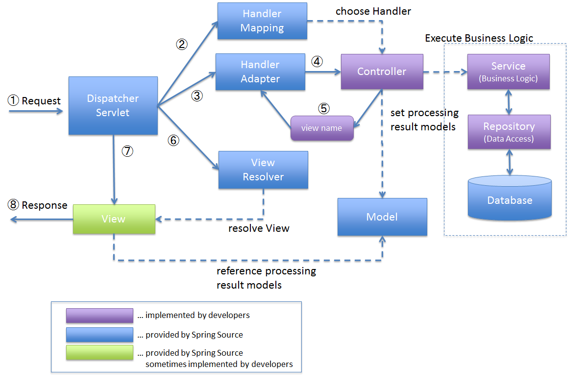
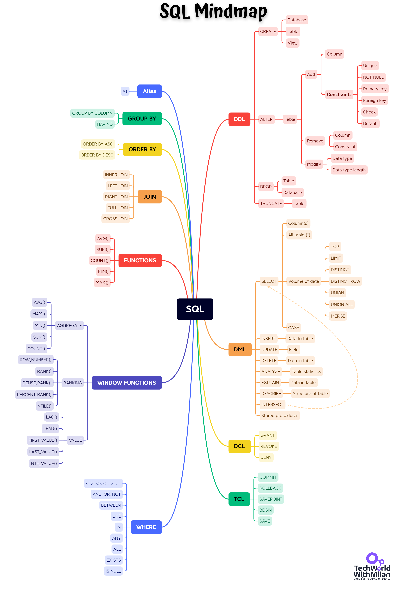

# MoneyDiary

A Spring and Angular based Expense Tracker Web App

## Architecture Diagram

**Frontend**: Angular, TypeScript, Boostrap

**Backend**: Spring MVC, Spring Boot, Spring data JPA, MySQL, JUnit

**Developer Tools**: IntelliJ IDEA, npm, Maven, AWS, Git/Github


## Angular

Angular is a development platform, built on TypeScript. As a platform, Angular includes:

A component-based framework for building scalable web applications
A collection of well-integrated libraries that cover a wide variety of features, including routing, forms management, client-server communication, and more
A suite of developer tools to help you develop, build, test, and update your code
With Angular, you're taking advantage of a platform that can scale from single-developer projects to enterprise-level applications. Angular is designed to make updating as straightforward as possible, so take advantage of the latest developments with minimal effort. Best of all, the Angular ecosystem consists of a diverse group of over 1.7 million developers, library authors, and content creators.


- **Components** - components are the building blocks that compose an application. A component includes a TypeScript class with a @Component() decorator, an HTML template, and styles. The @Component() decorator specifies the following Angular-specific information:
  1. A CSS selector that defines how the component is used in a template. HTML elements in your template that match this selector become instances of the component.
  2. An HTML template that instructs Angular how to render the component
  3. An optional set of CSS styles that define the appearance of the template's HTML elements

- **Templates** - every component has an HTML template that declares how that component renders. You define this template either inline or by file path.
Angular adds syntax elements that extend HTML so you can insert dynamic values from your component. Angular automatically updates the rendered DOM when your component's state changes.

- **Dependency injection** - dependency injection lets you declare the dependencies of your TypeScript classes without taking care of their instantiation. Instead, Angular handles the instantiation for you. This design pattern lets you write more testable and flexible code. Understanding dependency injection is not critical to start using Angular, but it is strongly recommended as a best practice. Many aspects of Angular take advantage of it to some degree.

- **Directives** - directives are classes that add additional behavior to elements in your Angular applications. Use Angular's built-in directives to manage forms, lists, styles, and what users see.

- **Angular CLI** - the Angular CLI is the fastest, straightforward, and recommended way to develop Angular applications. The Angular CLI makes some tasks trouble-free. For example commands : ng build, ng serve, ng generate, ng test, ...

This project was generated with [Angular CLI](https://github.com/angular/angular-cli) version 16.0.5.


**@angular/common/http**

**class HttpClient**

The class HttpClient Performs HTTP ***requests***. This service is available as an injectable class, with methods to perform HTTP requests. Each request method has multiple signatures, and the return type varies based on the signature that is called (mainly the values of observe and responseType).


## Spring MVC

**Spring**

The Spring Framework provides a comprehensive programming and configuration model for modern Java-based enterprise applications - on any kind of deployment platform.


**Spring Web MVC**

The Spring Web MVC framework provides Model-View-Controller (MVC) architecture and ready components that can be used to develop flexible and loosely coupled web applications. The MVC pattern results in separating the different aspects of the application (input logic, business logic, and UI logic), while providing a loose coupling between these elements.

- The **Model** encapsulates the application data and in general they will consist of POJO.

- The **View** is responsible for rendering the model data and in general it generates HTML output that the client's browser can interpret.

- The **Controller** is responsible for processing user requests and building an appropriate model and passes it to the view for rendering.



Spring Web model-view-controller (MVC) framework is designed around a DispatcherServlet that handles all the HTTP requests and ***responses***.

- **DispatcherServlet**: The front controller, is the core of the entire SpringMVC, which is responsible for coordinating the work of various components. It is responsible for receiving HTTP requests and entrusting them to components such as HandlerMapping, HandlerAdapter, and ViewResolver for processing.
- **Handler (Controller)**: completes specific business logic, equivalent to Servlet or Action.
- **HandlerMapping**: Responsible for mapping requests to the corresponding Handler (Controller).
- **HandlerInterceptor**: is an interface. If you need to complete some interception processing, you can implement this interface.
- **HandlerExecutionChain**: HandlerExecutionChain includes two parts: Handler and HandlerInterceptor (the system will have a default HandlerInterceptor, if you need to set up additional interception, you can add an interceptor).
- **HandlerAdapter**: Responsible for calling Handler (Controller) methods and encapsulating the processing results, passing them to DispatcherServlet.
- **ModelAndView**: Model data and view information, and it will be returned to DispatcherServlet as the processing result of Handler.
- **HandlerExceptionResolver**: Any Spring bean declared in the DispatcherServlet's application context that implements HandlerExceptionResolver interface will be used to intercept and process any exception raised in the MVC system and not handled by a Controller. The handler refers to the controller that generated the exception (remember that @Controller instances are only one type of handler supported by Spring MVC). Behind the scenes, MVC creates three such resolvers by default: 1. ExceptionHandlerExceptionResolver matches uncaught exceptions against suitable @ExceptionHandler methods on both the handler (controller) and on any controller-advices. 2. ResponseStatusExceptionResolver looks for uncaught exceptions annotated by @ResponseStatus. 3. DefaultHandlerExceptionResolver converts standard Spring exceptions and converts them to HTTP Status Codes.
- **ViewResolver**: View resolver, responsible for parsing out the corresponding View based on the view name, and finally responding to the client with the rendering result.


Following is the sequence of events corresponding to an incoming HTTP request to DispatcherServlet −

1. The client sends an HTTP request to the front-end controller DispatcherServlet.
2. DispatcherServlet, based on the request information, calls the HandlerMapping to resolve the handler (Controller) corresponding to the request.
3. HandlerMapping searches for the corresponding Controller based on the request URL and generates the HandlerExecutionChain object (Interceptor + Handler(Controller)) to execute the request.
4. DispatcherServlet calls HandlerAdapter to execute Handler. During execution, HandlerAdapter will pass the ModelAndView object to DispatcherServlet.
5. After the Handler is executed, a ModelAndView object is returned to the HandlerAdapter.
6. HandlerAdapter passes the ModelAndView object to DispatcherServlet.
7. Any exceptions that happened in steps 4- 6 will be processed by the HandlerExceptionResolver interface.
8. DispatcherServlet calls ViewResolver to resolve the view (View).
9. After ViewResolver parses out the View object, it returns it (ModelAndView) to DispatcherServlet.
10. DispatcherServlet calls the render() method of the View object to render the view.
11. DispatcherServlet returns the rendered view to the client.


All the above-mentioned components, i.e. HandlerMapping, Controller, and ViewResolver are parts of WebApplicationContext which is an extension of the plainApplicationContext with some extra features necessary for web applications

## Spring Boot

In Simple Terminology, Spring Boot is nothing but existing Spring Framework + Some Embedded HTTP Servers (Tomcat/Jetty, etc.) - XML or Annotations Configurations. Here minus means we don’t need to write any XML Configuration and few Annotations only.

The main goal of Spring Boot Framework is to reduce Development, Unit Test, and Integration Test time and to ease the development of Production-ready web applications very easily compared to existing Spring Framework, which really takes more time.


Why Spring Boot?

- To ease and reduce Development, Unit Test, and Integration Test time by providing some defaults, increasing productivity.
- It avoids writing lots of boilerplate Code like simplfing Annotations, choosing pom.xml denpendencies when creating spring boot app, avoiding XML bean configuration and avoiding javaweb/spring/springMVC/test/databases configuration classes like ServletConfig, SpringConfig, SpringMvcConfig, SpringJUnit4ClassRunner, JdbcConfig, MybatisConfig, SqlSessionFactoryBean, etc.
- To avoid defining more Annotation Configuration (It combined some existing Spring Framework Annotations to a simple and single Annotation), like @SpringBootApplication = @EnableAutoConfiguration + @ComponentScan + @Configuration, @RestController, @RestControllerAdvice, etc.
- To avoid writing lots of import statements.
- It is very easy to integrate Spring Boot Applications with its Spring Ecosystem like Spring JDBC, Spring ORM, Spring Data, Spring Security etc.
- It follows “Opinionated Defaults Configuration”/"Convention over Configuration" Approach to reduce Developer effort, like using spring-boot-starter-web to make using web/MVC environment as a convention.
- It provides Embedded HTTP servers like Tomcat, Jetty etc. to develop and test our web applications very easily. It provides easy maintenance and creation of REST endpoints.
- It provides CLI (Command Line Interface) tool to develop and test Spring Boot(Java or Groovy) Applications from command prompt very easily and quickly.
- It provides lots of plugins to develop and test Spring Boot Applications very easily using Build Tools like Maven and Gradle.
- It provides lots of plugins to work with embedded and in-memory Databases very easily.
- Deployment is very easy, war and jar files can be easily deployed in the Tomcat server.


## Spring Data JPA & Hibernate

**Java Persistence API**

JPA stands for Jakarta Persistence API (JPA), formerly known as Java Persistence API. JPA is just a specification that facilitates object-relational mapping to manage relational data in Java applications. It provides a platform to work directly with objects instead of using SQL statements.

**Spring Data JPA**

Spring Data JPA is part of Spring Data family. Spring Data makes it easier to create Spring driven applications that use new ways to access data, such as non-relational databases, map-reduction frameworks, cloud services, as well as well-advanced relational database support. Spring Data JPA - part of the larger Spring Data family, makes it easy to easily implement JPA based repositories. This module deals with enhanced support for JPA based data access layers. It makes it easier to build Spring-powered applications that use data access technologies. 

- We can use Spring Data JPA to reduce the amount of boilerplate code required to implement the data access object (DAO) layer.
- Spring Data JPA is not a JPA provider. It is a library/framework that adds an extra layer of abstraction on top of our JPA provider (like Hibernate). Spring Data JPA always requires the JPA provider such as Hibernate or Eclipse Link.
- Spring Data JPA uses Hibernate as a default JPA provider. Hibernate provides a reference implementation of the Java Persistence API that makes it a great choice as an ORM (Object-Relational Mapping) tool with the benefits of loose coupling.

**JpaRepository, CRUD operations**

Spring JPA handle most of the work for us and we only need to define the interface.  JpaRepository is a JPA (Java Persistence API) specific extension of Repository. It contains the full API of CrudRepository and PagingAndSortingRepository. So it contains API for basic CRUD operations and also API for pagination and sorting. The @Repository annotation helps Spring to bootstrap the JPA features during component scanning. The JpaRepository provide several OOTB methods to help us get started.

1. save(S entity)
2. saveAll(entities)
3. findById(ID id)
4. findOne()
5. findAll()
6. deleteAllInBatch(entities)
7. ...

**Hibernate**

Hibernate is an object-relational mapping solution for Java environments. Object-relational mapping or ORM is the programming technique to map application domain model objects to the relational database tables. 
Hibernate provides a reference implementation of the Java Persistence API that makes it a great choice as an ORM tool with the benefits of loose coupling.


## MySQL & SQL

MySQL is the world’s most popular open source database. According to DB-Engines, MySQL ranks as the second-most-popular database, behind Oracle Database. MySQL powers many of the most accessed applications, including Facebook, Twitter, Netflix, Uber, Airbnb, Shopify, and Booking.com. MySQL is a relational database management system Databases are the essential data repository for all software applications. For example, whenever someone conducts a web search, logs in to an account, or completes a transaction, a database system is storing the information so it can be accessed in the future.

**Database**

Aa database is a structured collection of data organized and stored in tables. It serves as a central repository where information is efficiently managed, allowing users to store, retrieve, update, and delete data. MySQL provides the software framework to create, maintain, and interact with these databases, making data storage and retrieval seamless and reliable.

**Relational Database**

A relational database stores data in separate tables rather than putting all the data in one big storeroom. The database structure is organized into physical files optimized for speed. The logical data model, with objects such as data tables, views, rows, and columns, offers a flexible programming environment. You set up rules governing the relationships between different data fields, such as one to one, one to many, unique, required, or optional, and “pointers” between different tables. The database enforces these rules so that with a well-designed database your application never sees data that’s inconsistent, duplicated, orphaned, out of date, or missing.

**SQL**

Structured query language (SQL) is a programming language for storing and processing information in a relational database. A relational database stores information in tabular form, with rows and columns representing different data attributes and the various relationships between the data values. You can use SQL statements to store, update, remove, search, and retrieve information from the database. You can also use SQL to maintain and optimize database performance.



**How Does MySQL Work?**

The basic structure of the client-server structure involves one or more devices connected to a server through a specific network. Every client can make a request from the graphical user interface (GUI) on their screens, and the server will produce the desired output, as long as both ends understand the instruction. Without getting too technical, the main processes taking place in a MySQL environment are the same, which are:

1. MySQL creates a database for storing and manipulating data, defining the relationship of each table.
2. Clients can make requests by typing specific SQL statements on MySQL.
3. The server application will respond with the requested information, and it will appear on the client’s side.
From the client’s side, they usually emphasize which MySQL GUI to use. The lighter and more user-friendly the GUI is, the faster and easier their data management activities will be.

Some of the most popular MySQL GUIs are MySQL WorkBench, SequelPro, DBVisualizer, and the Navicat DB Admin Tool. Some of them are free, while some are commercial, some run exclusively for macOS, and some are compatible with major operating systems. Clients should choose the GUI depending on their needs. For web database management, including a WordPress site, the most obvious go-to is phpMyAdmin.


**Advantages of SQL**

- Faster Query Processing: Large amount of data is retrieved quickly and efficiently. Operations like Insertion, deletion, manipulation of data is also done in almost no time. 
- No Coding Skills: For data retrieval, large number of lines of code is not required. All basic keywords such as SELECT, INSERT INTO, UPDATE, etc are used and also the syntactical rules are not complex in SQL, which makes it a user-friendly language. 
- Standardized Language: Due to documentation and long establishment over years, it provides a uniform platform worldwide to all its users. 
- Portable: It can be used in programs in PCs, server, laptops independent of any platform (Operating System, etc). Also, it can be embedded with other applications as per need/requirement/use. 
- Interactive Language: Easy to learn and understand, answers to complex queries can be received in seconds. 
- Scalability: SQL databases can handle large volumes of data and can be scaled up or down as per the requirements of the application.
- Security: SQL databases have built-in security features that help protect data from unauthorized access, such as user authentication, encryption, and access control.
- Data Integrity: SQL databases enforce data integrity by enforcing constraints such as unique keys, primary keys, and foreign keys, which help prevent data duplication and maintain data accuracy.
- Backup and Recovery: SQL databases have built-in backup and recovery tools that help recover data in case of system failures, crashes, or other disasters.
- Data Consistency: SQL databases ensure consistency of data across multiple tables through the use of transactions, which ensure that changes made to one table are reflected in all related tables.

**Drawbacks of MySQL**

- MySQL is not efficient when it comes to large databases.
- MySQL has performance issues when scaling databases.
- Because MySQL databases have a schema, they are vulnerable to SQL injection attacks.
- MySQL databases have a predefined structure. Changing the structure later can be costly.
- Working with rows and columns is more complicated than working with JSON documents.


# Angular 9, Spring boot and MySQL Web Applicaton - Expense Tracker
A simple expense tracking application built with Angular 9 and Spring boot that connects to the MySQL database. Application built using spring data JPA to perform database operations. Users can add, list, update, delete, sort, and filter the expenses.

## Requirements

1. Java - 1.8.x

2. Maven - 3.x.x

3. Mysql - 5.x.x

4. Angular - 9.x.x

5. Node - 12.x.x

6. Npm - 6.x.x

## Steps to Setup

**1. Clone the application**

```bash
git clone https://github.com/scbushan05/angular9-springboot-expensetracker.git
```

**2. Create Mysql database**
```bash
create database expensetracker
```

**3. Change mysql username and password as per your installation**

+ open `src/main/resources/application.properties`

+ change `spring.datasource.username` and `spring.datasource.password` as per your mysql installation

**4. Build and run the app using maven (expensetracker)**

```bash
mvn package
java -jar target/expensetracker-v1.jar
```

Alternatively, you can run the app without packaging it using -

```bash
mvn spring-boot:run
```

The app will start running at <http://localhost:8080>.

## Explore Rest APIs

The app defines following CRUD APIs.

    GET /api/v1/expenses
    
    POST /api/v1/expenses
    
    GET /api/v1/expenses/{expenseId}
    
    DELETE /api/v1/expenses/{expenseId}

You can test them using postman or any other rest client.

**5. Install node modules for angular application (expense-tracker-frontend)**

```bash
npm install
```

**6. Run the angular application**

```bash
ng serve
```

Alternatively, you can run the below command to open the application in default web browser -

```bash
ng serve --open
```

## Learn more
