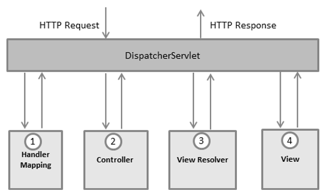

# MoneyDiary

A Spring and Angular based Expense Tracker Web App

## Architecture Diagram

**Frontend**: Angular, npm, TypeScript, Boostrap

**Backend**: Spring MVC, Spring Boot, Spring data JPA, MySQL database, Maven

## Angular

Angular is a development platform, built on TypeScript. As a platform, Angular includes:

A component-based framework for building scalable web applications
A collection of well-integrated libraries that cover a wide variety of features, including routing, forms management, client-server communication, and more
A suite of developer tools to help you develop, build, test, and update your code
With Angular, you're taking advantage of a platform that can scale from single-developer projects to enterprise-level applications. Angular is designed to make updating as straightforward as possible, so take advantage of the latest developments with minimal effort. Best of all, the Angular ecosystem consists of a diverse group of over 1.7 million developers, library authors, and content creators.

- Components - components are the building blocks that compose an application. A component includes a TypeScript class with a @Component() decorator, an HTML template, and styles. The @Component() decorator specifies the following Angular-specific information:
 1. A CSS selector that defines how the component is used in a template. HTML elements in your template that match this selector become instances of the component.
 2. An HTML template that instructs Angular how to render the component
 3. An optional set of CSS styles that define the appearance of the template's HTML elements

- Templates - every component has an HTML template that declares how that component renders. You define this template either inline or by file path.
Angular adds syntax elements that extend HTML so you can insert dynamic values from your component. Angular automatically updates the rendered DOM when your component's state changes.

- Dependency injection - dependency injection lets you declare the dependencies of your TypeScript classes without taking care of their instantiation. Instead, Angular handles the instantiation for you. This design pattern lets you write more testable and flexible code. Understanding dependency injection is not critical to start using Angular, but it is strongly recommended as a best practice. Many aspects of Angular take advantage of it to some degree.

- Directives - directives are classes that add additional behavior to elements in your Angular applications. Use Angular's built-in directives to manage forms, lists, styles, and what users see.

- Angular CLI - the Angular CLI is the fastest, straightforward, and recommended way to develop Angular applications. The Angular CLI makes some tasks trouble-free. For example commands : ng build, ng serve, ng generate, ng test, ...

This project was generated with [Angular CLI](https://github.com/angular/angular-cli) version 16.0.5.

## Spring MVC

The Spring Framework provides a comprehensive programming and configuration model for modern Java-based enterprise applications - on any kind of deployment platform.

Spring Web MVC - the Spring Web MVC framework provides Model-View-Controller (MVC) architecture and ready components that can be used to develop flexible and loosely coupled web applications. The MVC pattern results in separating the different aspects of the application (input logic, business logic, and UI logic), while providing a loose coupling between these elements.

- The Model encapsulates the application data and in general they will consist of POJO.

- The View is responsible for rendering the model data and in general it generates HTML output that the client's browser can interpret.

- The Controller is responsible for processing user requests and building an appropriate model and passes it to the view for rendering.

 - DispatcherServlet - the Spring Web model-view-controller (MVC) framework is designed around a DispatcherServlet that handles all the HTTP requests and responses.
Following is the sequence of events corresponding to an incoming HTTP request to DispatcherServlet −

1. After receiving an HTTP request, DispatcherServlet consults the HandlerMapping to call the appropriate Controller.
2. The Controller takes the request and calls the appropriate service methods based on used GET or POST method. The service method will set model data based on defined business logic and returns view name to the DispatcherServlet.
3. The DispatcherServlet will take help from ViewResolver to pickup the defined view for the request.
4. Once view is finalized, The DispatcherServlet passes the model data to the view which is finally rendered on the browser.

All the above-mentioned components, i.e. HandlerMapping, Controller, and ViewResolver are parts of WebApplicationContext which is an extension of the plainApplicationContext with some extra features necessary for web applications

## Spring Boot

Spring Boot is a project that is built on the top of the Spring Framework. It provides an easier and faster way to set up, configure, and run both simple and web-based applications. It is a Spring module that provides the RAD (Rapid Application Development) feature to the Spring Framework. It is used to create a stand-alone Spring-based application that you can just run because it needs minimal Spring configuration. 

- In short, Spring Boot is the combination of Spring Framework and Embedded Servers.
- In Spring Boot, there is no requirement for XML configuration (deployment descriptor). It uses convention over configuration software design paradigm that means it - decreases the effort of the developer.
- We can use Spring STS IDE or Spring Initializr to develop Spring Boot Java applications.
  
Why should we use Spring Boot Framework?

- The dependency injection approach is used in Spring Boot.
- It contains powerful database transaction management capabilities.
- It simplifies integration with other Java frameworks like JPA/Hibernate ORM, Struts, etc.
- It reduces the cost and development time of the application.

## Spring data JPA & MySQL

 - Spring Data JPA - part of the larger Spring Data family, makes it easy to easily implement JPA based repositories. This module deals with enhanced support for JPA based data access layers. It makes it easier to build Spring-powered applications that use data access technologies.

Implementing a data access layer of an application has been cumbersome for quite a while. Too much boilerplate code has to be written to execute simple queries as well as perform pagination, and auditing. Spring Data JPA aims to significantly improve the implementation of data access layers by reducing the effort to the amount that’s actually needed. As a developer you write your repository interfaces, including custom finder methods, and Spring will provide the implementation automatically.

- MySQL - is the world’s most popular open source database. According to DB-Engines, MySQL ranks as the second-most-popular database, behind Oracle Database. MySQL powers many of the most accessed applications, including Facebook, Twitter, Netflix, Uber, Airbnb, Shopify, and Booking.com.

